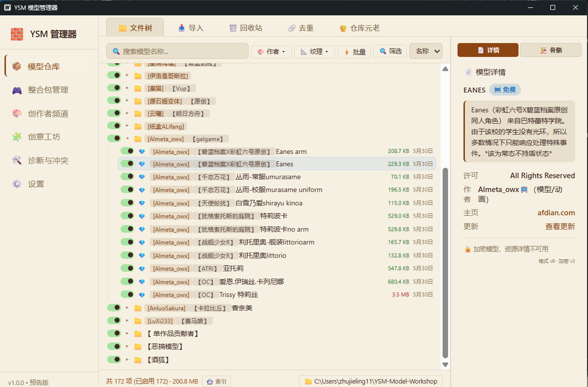
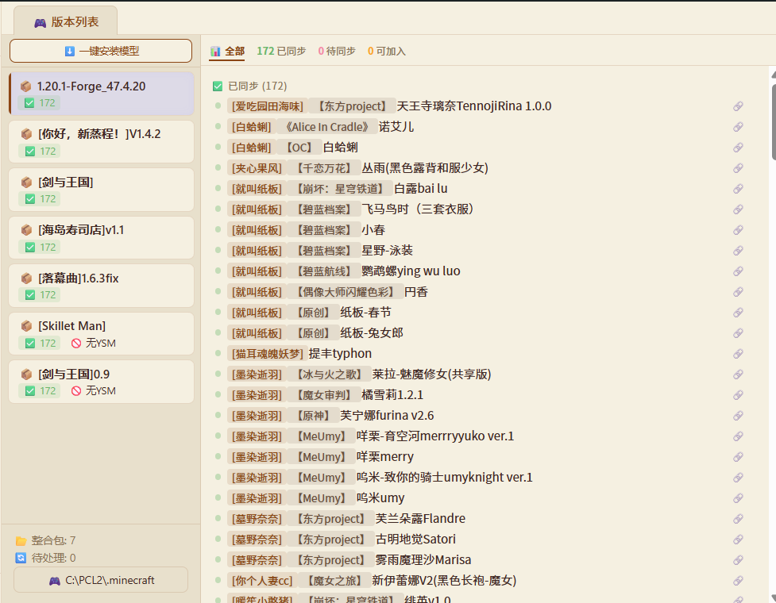
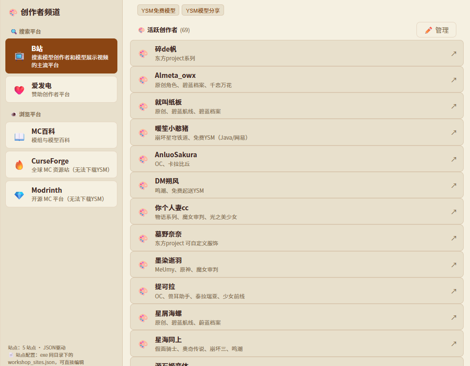
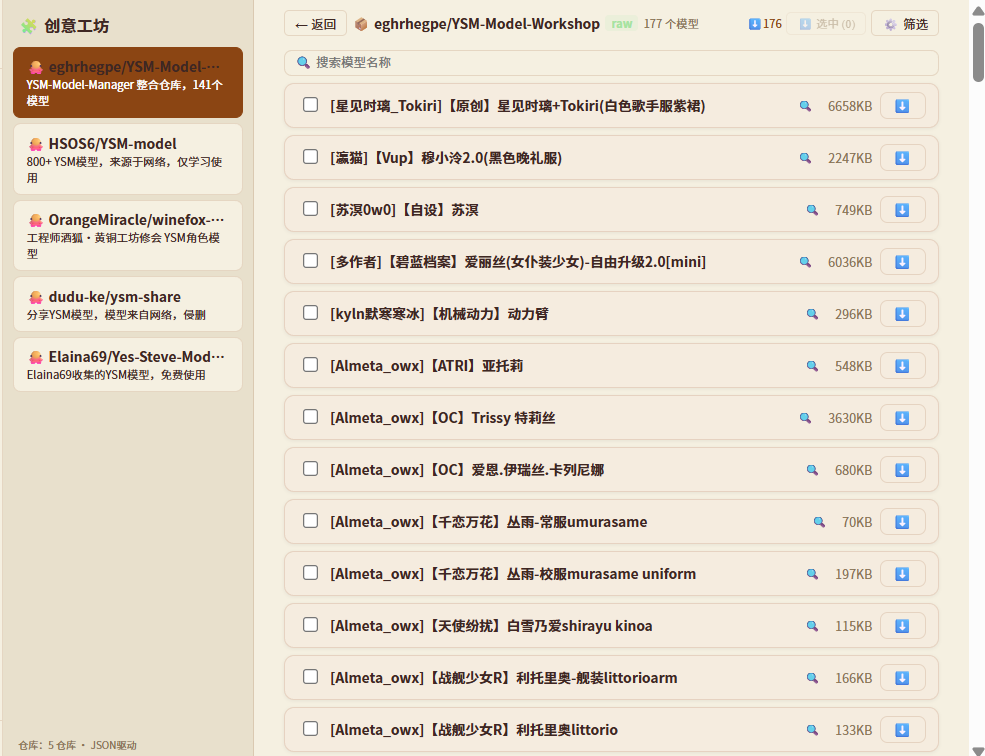

# 🧱 YSM 模型管理器

Minecraft YSM 模型的一站式管理工具 
仓库管理 · 整合包同步 · 3D 预览 · 冲突检测

<a class="btn-download" href="https://github.com/eghrhegpe/ysm-model-manager/releases" target="_blank">⬇️ 下载最新版本</a>
<a class="btn-secondary" href="https://github.com/eghrhegpe/ysm-model-manager" target="_blank">📦 GitHub 仓库</a>

---

## 🎬 功能介绍

<iframe src="https://player.bilibili.com/player.html?bvid=BV1vWEK6dEav&page=1&autoplay=0&high_quality=1" allowfullscreen></iframe>

---

## ✨ 核心特性

<h3>📦 模型仓库管理</h3>

以目录结构管理你的所有 YSM 模型，支持拖放导入、重命名、批量操作、筛选排序。仓库目录实时监听，文件变动自动同步。

<h3>🎮 整合包同步</h3>

自动检测所有 Minecraft 整合包，一眼看清每个包的同步状态——已同步、缺失、额外、禁用。一键安装缺失模型，同步启用/禁用状态。

<h3>🔍 冲突与诊断</h3>

扫描仓库中同名文件和重复哈希，检测整合包冲突。去重助手帮你保留一份、删除冗余，释放磁盘空间。

<h3>🖼️ 3D 预览</h3>

基于 Three.js 的内置 3D 渲染器，直接在应用内预览 YSM 模型骨骼结构。支持多纹理渲染、正确 UV 映射、骨骼层级展示。

<h3>🌐 创作者频道</h3>

内置创作者数据库（87+ 位作者），快速浏览各创作者的模型作品。支持自定义站点源，爱发电、工坊链接一键直达。

<h3>♻️ 回收站安全</h3>

删除的模型移入回收站而非直接删除。智能处理符号链接、硬链接、跨分区场景，`ensureInDir()` 防路径遍历攻击。

<h3>🔄 多种安装模式</h3>

支持复制、硬链接、符号链接三种安装方式。硬链接节省磁盘空间，符号链接适合跨仓库管理。自动检测跨分区并降级为复制。

<h3>⚙️ 高度可配置</h3>

支持 4 套主题（赛博朋克、暖阳、原版、深色），自定义仓库根目录和 Minecraft 目录，下载镜像源切换，自动更新。

---

## 📸 界面预览

---

## 📥 下载

| 版本         | 下载                                                                                                  | 说明                     |
| ------------ | ----------------------------------------------------------------------------------------------------- | ------------------------ |
| **最新版**   | [YSM-Model-Manager_windows_amd64.zip](https://github.com/eghrhegpe/ysm-model-manager/releases/latest) | Windows 64-bit，解压即用 |
| **全部版本** | [GitHub Releases](https://github.com/eghrhegpe/ysm-model-manager/releases)                            | 含发版说明和更新日志     |

### 系统要求

- **操作系统**: Windows 10 / Windows 11（64-bit）
- **依赖**: [WebView2 Runtime](https://developer.microsoft.com/microsoft-edge/webview2/)（Windows 10 1803+ 内置）
- **Minecraft**: 任意支持 YSM 模组（Yes Steve Model）的版本
- **磁盘空间**: 约 150 MB（应用）+ 模型文件空间

### 快速开始

1. 下载最新版 ZIP 并解压
2. 双击 `YSM-Model-Manager.exe` 启动
3. 在设置页面配置 **游戏根目录** 和 **仓库目录**
4. 将模型文件放入仓库目录，开始管理！

> 📖 详细教程请参阅 [用户指南](用户指南.md)

---

## 🛠️ 技术栈

Go
Wails v2
WebView2
Three.js
Vite
WASM

YSM 模型管理器基于 **Wails v2** 构建，Go 后端负责文件系统操作、YSM 解析、哈希计算、同步引擎；前端使用原生 JavaScript + Web Components + Shadow DOM 实现组件化。YSM 解析器编译为 WASM 内嵌在前端，无需外部依赖。

---

## 📄 文档

- [用户指南](用户指南.md) — 完整的使用教程
- [架构说明](architecture.md) — 项目架构与技术设计
- [发版说明](release-notes/) — 各版本更新详情
- [项目意义](项目意义.md) — 开发背后的故事

---

<a class="btn-secondary" href="https://github.com/eghrhegpe/ysm-model-manager/releases" target="_blank">⬇️ 下载</a>
<a class="btn-secondary" href="https://github.com/eghrhegpe/ysm-model-manager" target="_blank">💻 源码</a>
<a class="btn-secondary" href="用户指南.md">📖 指南</a>
<a class="btn-secondary" href="https://www.bilibili.com/video/BV1vWEK6dEav/" target="_blank">▶️ 视频</a>

<footer>
Made with 🧱 by eghrhegpe &nbsp;·&nbsp; 2026 &nbsp;·&nbsp;
<a href="https://github.com/eghrhegpe/ysm-model-manager/blob/main/LICENSE">MIT License</a>
</footer>
